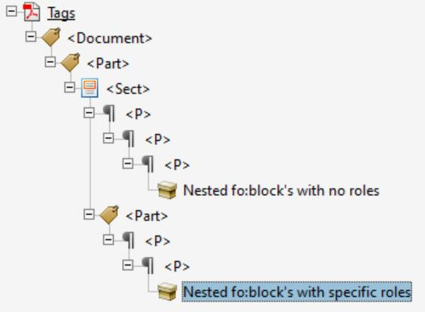
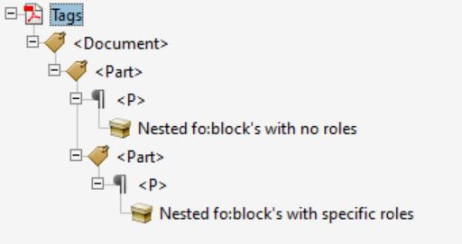
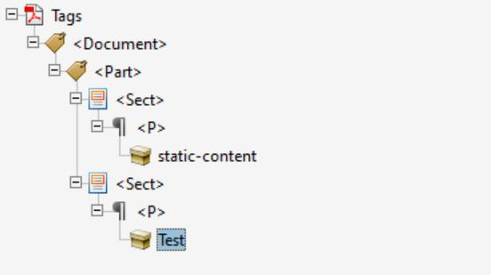
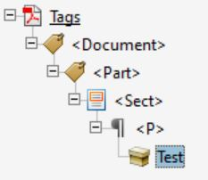
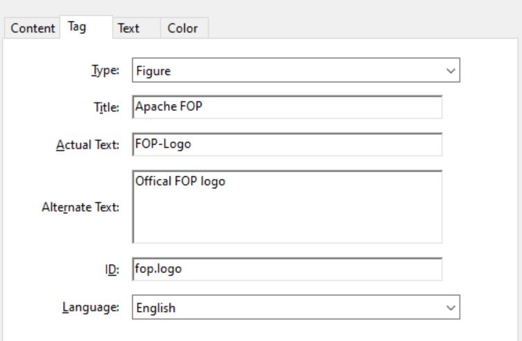
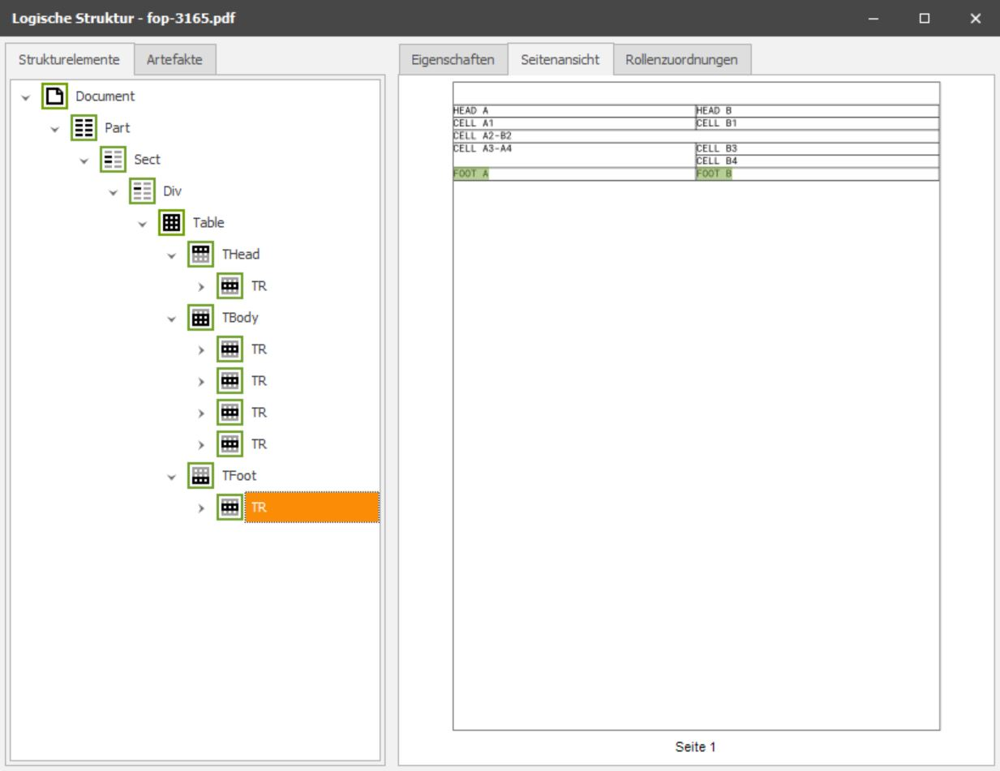
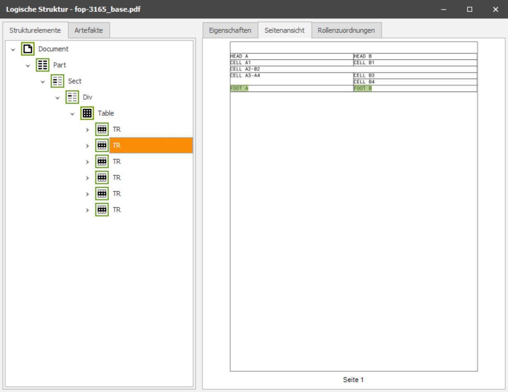
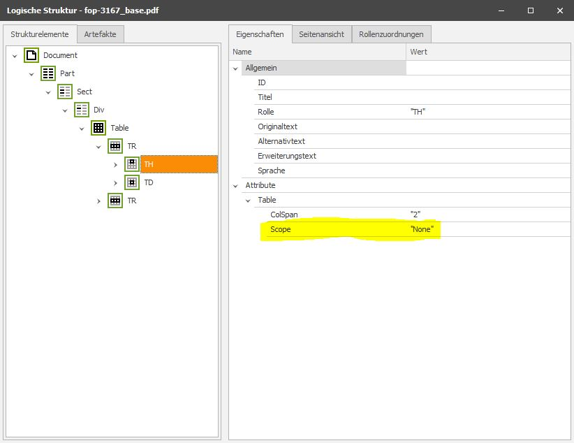
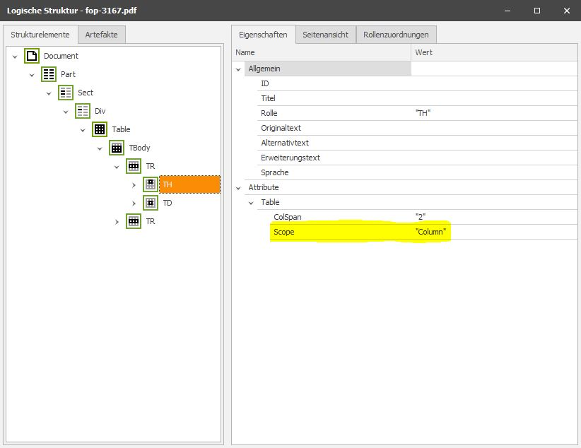

# Accessibility examples

To execute the given examples you have to do the following:

1. Run `ant` to execute the tests.
1. Find the results in [_results](_results/) (for the laizy ones the results are already commited here)

Some general notes:

1. The used config is always [fop.xconf](fop.xconf)
2. If there is a `*_base.pdf` output, it is a comparision result of an equivalent FOP call but with deactivated the demonstrated feature.

## Example noautopdftag

The new switch `noautopdftag` disables the tagging for structrure-only FO nodes that do not have a role attribute. Structrure-only nodes are nodes that do not contain text content.

Relevant [FO input](noautopdftag/test.fo):

```xml
<fo:block><fo:block><fo:block>Nested fo:block's with no roles</fo:block></fo:block></fo:block>
<fo:block role="Part"><fo:block><fo:block role="P">Nested fo:block's with specific roles</fo:block></fo:block></fo:block>
```

Tag structure of the [base version](_results/noautopdftag_base.pdf):



Tag structure of the [adjusted version](_results/noautopdftag.pdf) (with active switch `noautopdftag`):



## Example rolemap

The new switch `-rolemap` provides a rolemap file. The rolemap file overrides the default tagging for FO elements by name. E.g. you can specify that the FO element static-content gets the tag Artifact by default.

Relevant [FO input](rolemap/test.fo):

```xml
<fo:static-content flow-name="xsl-region-before">
    <fo:block>static-content</fo:block>
</fo:static-content>
<fo:flow flow-name="xsl-region-body">
    <fo:block>Test</fo:block>
</fo:flow>
```

Used rolemap file:

```xml
<autotaggings>
	<autotagging name="static-content" value="Artifact"/>
</autotaggings>	
```

Tag structure of the [base version](_results/rolemap_base.pdf):



Tag structure of the [adjusted version](_results/rolemap.pdf) (with a specific rolemap file):




## Example tag-attributes

To specify attributes of PDF tags, a special syntax for roles has been introduced (based on data URLs). If you define a `<fo:block role="P?attr=value">` it will be converted to a PDF tag `P` with the attribute `"attr"` which has the value `"value"`.

Relevant [FO input](tag-attributes/test.fo):

```xml
<fo:external-graphic content-height="15mm" src="apache-fop-logo.jpg" fox:alt-text="Offical FOP logo"
                    role="Figure?T=Apache FOP;ID=fop.logo;Lang=EN;ActualText=FOP-Logo"/>
```

You find this Title, ID, Lang and Actual Test in the PDF attributes of [the result](_results/tag-attributes.pdf):



## Table tagging in PDF/UA mode

### Example for FOP-3165

This example demonstrates the table rendering of FOP with active PDF/UA mode. The general subject was discussed in the JIRA issue [FOP-3165](https://issues.apache.org/jira/browse/FOP-3165) In opposite to the examples above this uses the FOP config file [fop_ua.xconf](fop_ua.xconf) that ensures PDF/UA mode is active. While the base line FOP 2.9 skips the PDF tags for `table-header`, `table-body` and `table-footer`, the FOP 2.9a preserves them:



The base line FOP produce the following tag tree:



### Exmple for FOP-3167

This example demonstrates the fix for the JIRA issue [FOP-3167](https://issues.apache.org/jira/browse/FOP-3167). 

Relevant [FO input](fop-3167/test.fo):

```xml
<fo:table-cell number-columns-spanned="2" role="TH">
    <fo:block>head A</fo:block>
</fo:table-cell>
```

Attributes of the corresponding `TH` tag in PDF result using FOP 2.9:



Same tag attributes in PDF result using FOP 2.9a:



